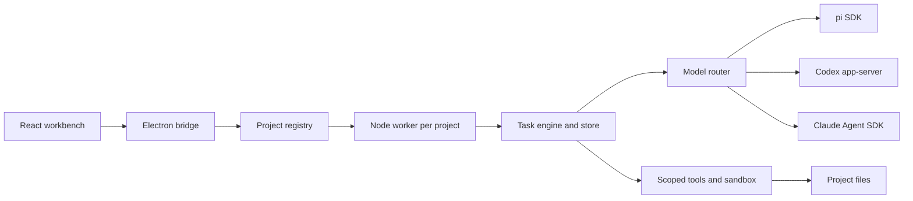

# Architecture

Boan is a local task workbench, not a session manager.

- `src/`: workbench, project navigation, composer, task details, settings and language controls.
- `shared/`: shared translation catalog and locale formatting; used by both renderer and native shell.
- `desktop/`: Electron lifecycle, isolated bridge, model authentication, project worker pool and settings.
- `server/`: persistent task engine, management operations, requirements, dependencies, model backends, scoped file tools, command permissions, verification, recovery and loopback HTTP.
- `tests/`: unit, SDK/protocol integration, browser UI and hidden desktop tests.
- `scripts/`: development, build support and release retention.

Each project's main execution is sequential. Projects progress independently. The host validates management proposals against task identity, current versions and evidence before applying them. Requirements are saved before delivery; execution must acknowledge changed requirements. Replacing a lost or unsuitable execution requires a handoff and current-file observations.

Dependencies use current verified upstream delivery or explicit user acceptance. Bounded auxiliary work has separate scope and budgets, and must be reviewed and integrated by the main executor. Model responses are proposals, not proof of completion.

Verification runs independently through the host. Results remain awaiting acceptance until the user confirms them. Pauses, errors, uncertain operations and stale evidence remain visible, without replaying old approvals.

The desktop window and execution workers have separate lifetimes. Closing a macOS window can keep tasks running; quitting stops workers and saves state. Project state, credentials and UI drafts are stored outside the source repository. Language and appearance are app preferences, while task drafts and layout are project-specific.

The browser mode uses the same workbench against a single local project server. It does not include the desktop authentication bridge or the multi-project worker registry.
